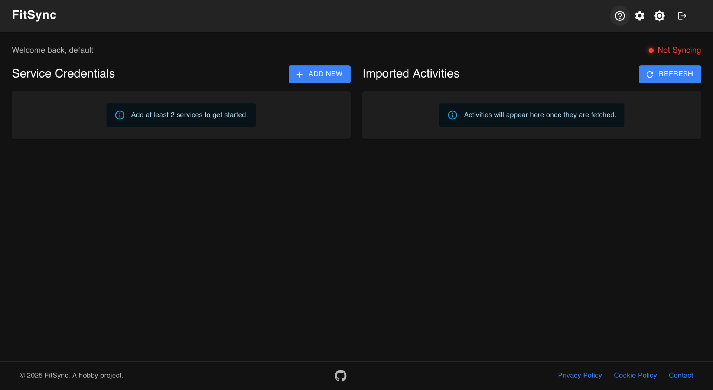

# FitSync 🚴‍♂️

Automatically syncs Zwift activities to Garmin Connect so they actually count towards Training Load, VO2 Max, and other metrics. It works by editing Zwift activities to look like they were recorded on a Garmin device before uploading them. Activites are fetched and uploaded in the background so you can just Ride On!

**Live**: [fitsync.kaleba.app](https://fitsync.kaleba.app/) 🌐



## Running Locally 💻

**Prerequisites**: .NET 10.0 SDK
```bash
cd FitSync
dotnet run --project src/FitSync.AppHost
```

**Default credentials**: `default` / `default1`

Aspire handles everything - database migrations, service orchestration, test data seeding.

The mock fetcher will auto-verify every user every 30s on dev so you don't need SMTP config.

### Configuration

The mock fetcher runs by default and processes test `.fit` files for the default user.

You can log in and change the Garmin credentials to test against a real Connect account.

Alternatively you can configure `appsettings.json` so it is auto-populated on startup:
```json
"MockFetcherOptions": {
  "RunFetcher": false,  // Disable/Enable mock fetching for default user
  "GarminUsername": "your-email@example.com",  // If you want to test with a real Connect account
  "GarminPassword": "your-password"
}
```

*Create a test account if you do this*

## Architecture 🏗️

Microservices (fetcher, uploader, API, GUI) + Kafka + PostgreSQL + Kubernetes deployment.

## Future Work 🚀

- Fetchers for Wahoo, Strava, etc.
- Upload to multiple destinations
- Bi-directional sync
- Health checks for source/destination services before processing
- Pause workers when upstream/downstream services unavailable
- Overall service indicator (GUI)

---

PRs welcome. Dev environment is zero-config.